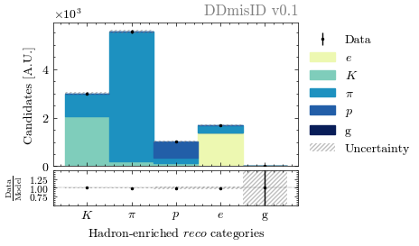

# DDMisID

Repository for the standalone tool **D**ata**D**riven**MisID** to extrapolate a misID template from a control region in data. Such a task is executed via the assignment of per-event weights.

## Methodology

$$w_{\mathrm{misID}} = \sum_{i\in\{p,K,\pi,e,g\}} \frac{N_i}{N_{\mathrm{ref}}} \frac{1}{\varepsilon_{\mathrm{PID}}{(i \to !\mu)}}\varepsilon_{\mathrm{PID}}(i\to \mu)$$

where the true abundance of each species in the reference control sample, $N_i$, is given by unfolding the observed abundance of each species in high-purity partitions of the control sample, accounting for cross-contamination due to imperfect particle identification (PID):

$$N_i^{\mathrm{obs}} = \sum_i \sum_j N_i^{\mathrm{}}\,\varepsilon(i\to j)$$

Here, $j$ indexes the high-purity partitions in the reference sample, and $i \in \{p, K, \pi, e, g\}$ (with $g$ denoting _ghosts_ in the LHCb reconstruction jargon).

The unfolding is executed by means of binned maximum-likelihood fits within. In turn, each fit is executed in bins of kinematics and occupaancy, to account for the variation of PID responses with momentum, pseudo-rapidity, and detector occupancy. 

As an example, `DDmisID` extracts the true abundance of each species, in each bin of kinematics and occupancy, as yields extracted in fits such as this one:

  

*Binned maximum likelihood fit to orthogonal, high-purity partitions of the hadron-enriched data. The filled coloured histograms illustrate the post-fit extracted abundance of each species, accounting of cross-contamination between the partitions due to imperfect PID. Generated with in-house pseudo-data mimicking the LHCb reconstruction*.

## Developer (local) installation

1. Source the LHCb environment to run in Python 3.9 and make use of `pidcalib2`: `$ source /cvmfs/lhcb.cern.ch/lib/LbEnv`
2. Install locally via `pip`. In the root directory: `$ pip install -e .`

## Running DDmisID

1. Edit `config/main.yml`
2. Run Snakemake in the same firectory where `Snakefile` is located via `snakemake --cores`.

## License

This project is licensed under the [MIT License](https://opensource.org/license/MIT). See [LICENSE](LICENSE) for more information.

