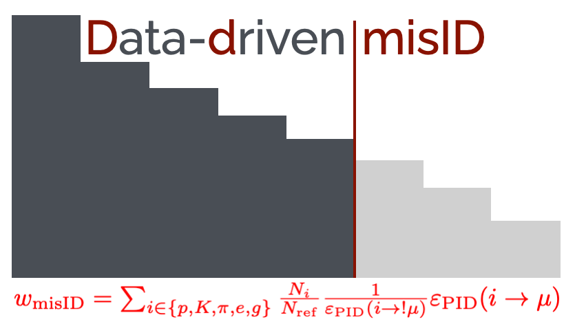
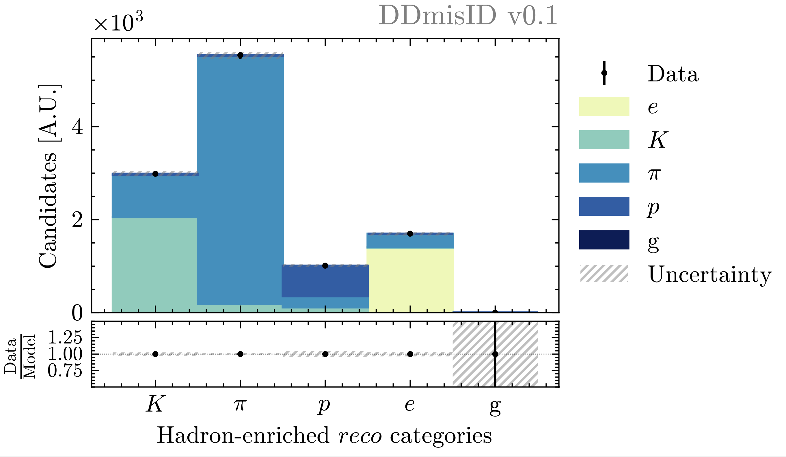

<div style="text-align:left;">
  
</div>

# DDMisID

Python library for **D**ata**D**riven**MisID** modelling. This derives a single-track misID template and event yield from a control region in data. Such a task is executed via the assignment of per-event weights obtained from particle identification efficiency maps. In turn, these are (mostly) produced from bespoke high-purity, high-statistics calibration data samples via [PIDCalib2](https://pypi.org/project/pidcalib2/).

## Methodology

$$w_{\mathrm{misID}} = \sum_{i\in\{p,K,\pi,e,g\}} \frac{N_i}{N_{\mathrm{ref}}} \frac{1}{\varepsilon_{\mathrm{PID}}{(i \to !\mu)}}\varepsilon_{\mathrm{PID}}(i\to \mu)$$

where the true abundance of each species in the reference control sample, $N_i$, is given by unfolding the observed abundance of each species in high-purity partitions of the control sample, accounting for cross-contamination due to imperfect particle identification (PID):

$$N_i^{\mathrm{obs}} = \sum_i \sum_j N_i^{\mathrm{}}\varepsilon(i\to j)$$

Here, $j$ indexes the high-purity partitions in the reference sample, and $i \in \{p, K, \pi, e, g\}$ (with $g$ denoting _ghosts_ in the LHCb reconstruction jargon).

The unfolding is executed by means of binned maximum-likelihood fits within. In turn, each fit is executed in bins of kinematics and occupaancy, to account for the variation of PID responses with momentum, pseudo-rapidity, and detector occupancy. 

As an example, `DDmisID` extracts the true abundance of each species, in each bin of kinematics and occupancy, as yields extracted in fits such as this one:

<div style="text-align:center;">
  
</div>

*Binned maximum likelihood fit to orthogonal, high-purity partitions of the hadron-enriched data. The filled coloured histograms illustrate the post-fit extracted abundance of each species, accounting of cross-contamination between the partitions due to imperfect PID. Generated with in-house pseudo-data mimicking the LHCb reconstruction*.

## Installation

### 1. Clone the Repository 
```bash
git clone git@github.com:reallyblaised/DDmisID.git
cd DDmisID
```
### 2. Install Dependencies

For regular use: 

```bash
pip install -r requirements.txt
```

For developement (editable mode, and recommended until further notice):

```bash
pip install -e . 
```

## Running DDmisID

1. Edit YAML main configuration file, `config/main.yml`.
2. Build the DDmisID engine, parding the YAML configuration file, 
```bash 
dmisid-engine build --config config/main.yml
```
3. Run the DDmisID engine powered by a Snakemake backend with your specified options, _e.g._:
```bash
ddmisid-engine run --cores=4 --dry-run
```

## License

This project is licensed under the [MIT License](https://opensource.org/license/MIT). See [LICENSE](LICENSE) for more information.


